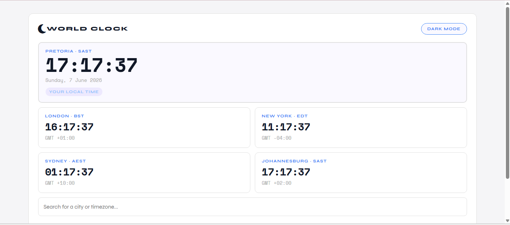

# 🌍 World Clock App

> 🚧 **Currently in development** — this project is actively being built as part of my front-end portfolio.

## About

A world clock web app that detects your location and displays live city clocks from around the world. Built with vanilla HTML, CSS and JavaScript — no frameworks.

## Live Demo

🔗 [View Live App](https://clock-everywhere.netlify.app/)

## Features (so far)

- ✅ Detects user's location and displays local city, timezone and live time
- ✅ Featured city clocks that tick live in real time
- ✅ City search powered by a world cities database
- 🔄 Add and remove city cards from the homepage
- 🔄 Dark mode toggle
- 🔄 Fully responsive design

## Built With

- HTML5
- CSS3
- Vanilla JavaScript
- Moment.js + Moment Timezone
- BigDataCloud Reverse Geocoding API
- Font Awesome
- Google Fonts (Space Mono + Syne)

## Author

**Mandi Lekalakala**
- GitHub: [@Mandi-Lekalakala](https://github.com/Mandi-Lekalakala)
- LinkedIn: [mandilekalakala](https://www.linkedin.com/in/mandilekalakala)
