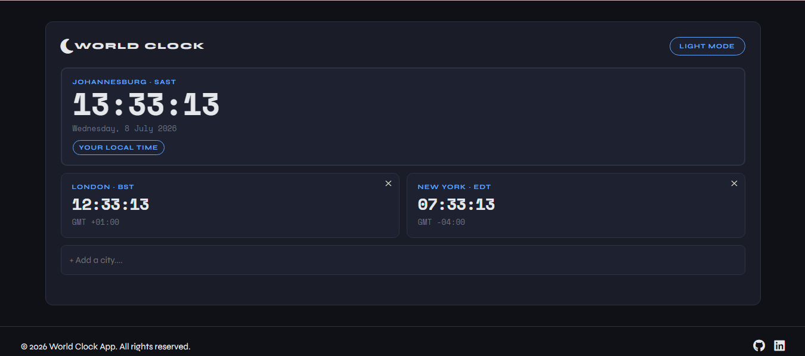

🌍 World Clock App

A world clock web app that detects your location and displays live city clocks from around the world. Built with vanilla HTML, CSS and JavaScript — no frameworks.

## About

A world clock web app that detects your location and displays live city clocks from around the world. Built with vanilla HTML, CSS and JavaScript — no frameworks.

## Live Demo

🔗 [View Live App](https://clock-everywhere.netlify.app/)

## Features (so far)

✅ Detects user's location and displays local city, timezone and live time
✅ Featured city clocks that tick live in real time
✅ City search powered by a world cities database of 500,000+ cities
✅ Add and remove city cards dynamically
✅ Dark and light mode toggle with localStorage persistence

## Built With

- HTML5
- CSS3
- Vanilla JavaScript
- Moment.js + Moment Timezone
- TimeZoneDB API
- Font Awesome
- Google Fonts (Space Mono + Syne)
- cities.json

## Author

**Mandi Lekalakala**
- GitHub: [@Mandi-Lekalakala](https://github.com/Mandi-Lekalakala)
- LinkedIn: [mandilekalakala](https://www.linkedin.com/in/mandilekalakala)
